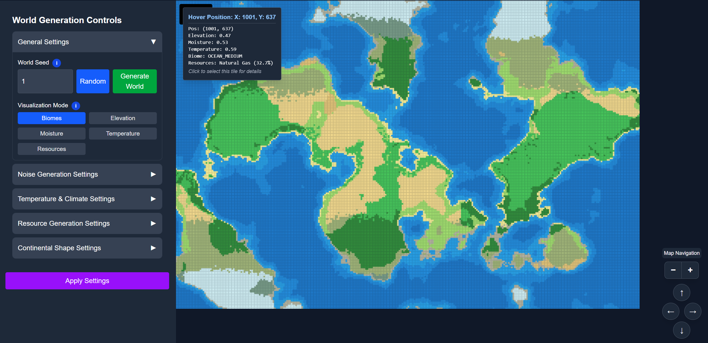
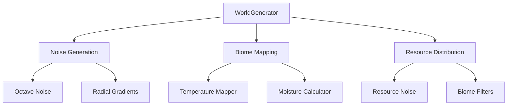

# Procedural World Generation Application

 <!-- Suggest adding a screenshot later -->

A sophisticated procedural world generator that creates realistic biomes with elevation, moisture, and temperature systems, plus resource distribution.

## Features

- **Multi-layered Noise Generation**
  - Octave-based Perlin noise for terrain
  - Separate noise layers for elevation/moisture/temperature
  - Configurable noise parameters (octaves, persistence, lacunarity)
- **Advanced Biome System**

  - 25+ biome types (from deserts to tundra)
  - Biome determination through 3-factor system
  - Radial gradient for continent shaping

- **Resource System**

  - 4 base resources (Iron, Copper, Coal, Gold)
  - Resource-specific generation rules
  - Deposit size and density calculations

- **Visualization Modes**
  - Biome colors
  - Individual factor views (elevation/moisture/temperature)
  - Resource overlay

## Technical Architecture



### Core Components

1. **World Generator (`worldGenerator.ts`)**

   - Combines noise layers into biome data
   - Handles coordinate transformations
   - Manages resource distribution rules

2. **Noise System (`octaveNoise.ts`, `noiseGenerator.ts`)**

   - Multi-octave Perlin noise implementation
   - Separate configurations for different terrain aspects
   - Seed-based reproducibility

3. **Biome Mapping (`biomeMapper.ts`, `temperatureMapper.ts`)**

   - Color mapping based on environmental factors
   - Temperature simulation with latitude effects
   - Moisture calculation from elevation and noise

4. **Resource System (`config.ts`)**
   - Type-specific generation parameters
   - Noise-based density calculations
   - Biome compatibility filters

## Configuration Options

Key tunable parameters in `config.ts`:

```typescript
// Example configuration
{
  WORLD_GRID_SIZE: { width: 2048, height: 1024 },
  BIOME_COLORS: {
    [BiomeType.TEMPERATE_DESERT]: { r: 238, g: 218, b: 130 },
    // ... other biome definitions
  },
  RESOURCE_CONFIGS: {
    [ResourceType.IRON]: {
      baseDensity: 0.15,
      noiseScale: 150,
      elevationRange: [0.3, 0.8],
      // ... resource-specific rules
    }
  }
}
```

## Installation & Usage

1. **Requirements**

   - Node.js v18+
   - npm/yarn

2. **Setup**

   ```bash
   git clone [repository-url]
   cd procedural-world-generator
   npm install
   ```

3. **Running**

   ```bash
   npm run dev
   ```

   Visit `http://localhost:3000`

4. **Controls**
   - Adjust seed values
   - Modify noise parameters
   - Toggle visualization modes
   - Regenerate world with new settings

## Optimization Features

- Precomputed gradient maps
- Noise caching strategies
- Web Worker integration (potential future expansion)
- Level-of-detail adjustments

## Development Guidelines

### Key Dependencies

- Next.js 14
- TypeScript 5
- Canvas API
- Noise algorithms (custom implementation)

### Code Structure

```
src/
├── app/
│ ├── components/
│ │ └── WorldGenerator/
│ │ ├── UI/ # Control components
│ │ ├── config.ts # Constants & configurations
│ │ ├── biomeMapper.ts # Biome color logic
│ │ └── worldGenerator.ts # Core generation logic
│ └── page.tsx # Main view
└── styles/ # Global CSS
```

## Future Roadmap

- [ ] Ocean currents simulation
- [ ] River generation
- [ ] Erosion simulation
- [ ] Dynamic climate change
- [ ] Save/load system for generated worlds

---

> **Note:** For detailed implementation specifics, refer to the inline documentation in each component. Use the `GenerationControls` component to experiment with different world configurations.
